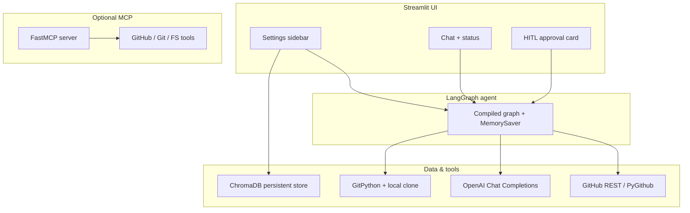
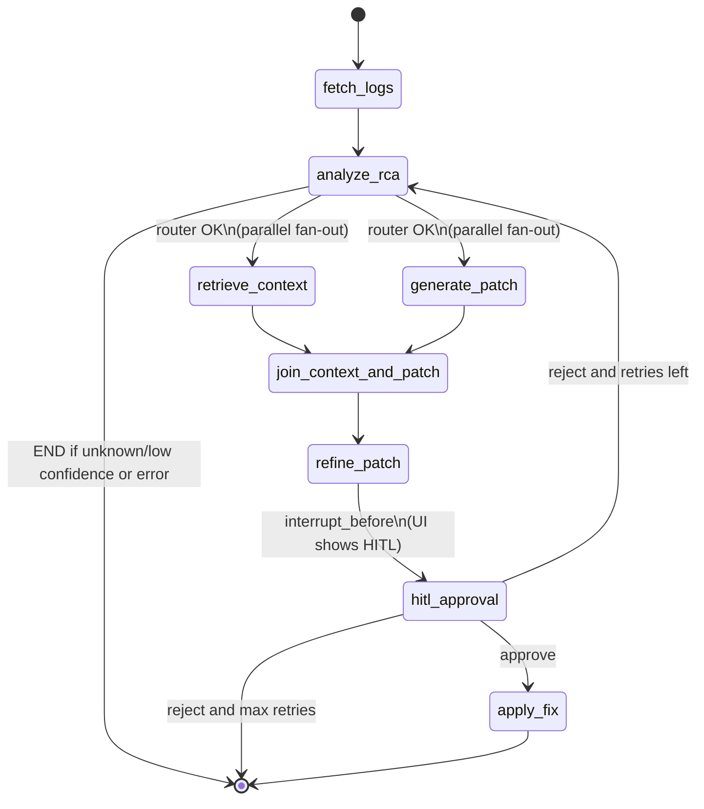

# PipelinePilot

**PipelinePilot** is an agentic assistant that triages **GitHub Actions** failures, performs **root cause analysis (RCA)** with an LLM, proposes **unified diffs** for fixes, and—after **human approval**—can **branch, commit, push, and open a pull request**. The runtime is a **LangGraph** state machine with **interrupt-before** human-in-the-loop (HITL), a **Streamlit** control room, optional **ChromaDB** indexing for repo context, and a **FastMCP** server that exposes GitHub/Git/filesystem tools.

---

## Table of contents

1. [High-level architecture](#high-level-architecture)  
2. [Repository layout](#repository-layout)  
3. [LangGraph workflow](#langgraph-workflow)  
4. [Pipeline state (`PipelineState`)](#pipeline-state-pipelinestate)  
5. [Human-in-the-loop (HITL)](#human-in-the-loop-hitl)  
6. [RAG and indexing](#rag-and-indexing)  
7. [MCP server](#mcp-server)  
8. [Streamlit UI](#streamlit-ui)  
9. [Requirements](#requirements)  
10. [Installation](#installation)  
11. [Configuration and secrets](#configuration-and-secrets)  
12. [Running the app](#running-the-app)  
13. [Testing](#testing)  
14. [Troubleshooting](#troubleshooting)  
15. [Security notes](#security-notes)  

---

## High-level architecture



- **Streamlit** drives each run: validates keys/repo, builds initial `PipelineState`, calls `graph.stream(...)`, and on interrupt renders the HITL card; resume uses `graph.update_state(...)` + `graph.stream(None, ...)`.  
- **LangGraph** owns orchestration, branching, checkpoints (`thread_id`), and the pause before `hitl_approval`.  
- **GitHub** supplies workflow runs, logs (with fallbacks—see [Troubleshooting](#troubleshooting)), file listing, and file contents.  
- **OpenAI** powers `analyze_rca` and patch generation/refinement.  
- **ChromaDB** (via `rag/indexer.py`) stores chunked repo text for future retrieval; `retrieve_context` today still leans on GitHub file reads and heuristics.  
- **MCP** exposes the same tool surface to external MCP clients (Cursor, Claude Desktop, etc.) independently of Streamlit.

---

## Repository layout

| Path | Role |
|------|------|
| `agent/graph.py` | Builds and compiles the LangGraph; `interrupt_before=["hitl_approval"]`; exports `build_graph()`. |
| `agent/state.py` | `PipelineState` TypedDict (inputs, logs, RCA, RAG, patch, HITL, outputs, `messages`, errors, `current_step`). |
| `agent/nodes/` | One module per graph node (`fetch_logs`, `analyze_rca`, `retrieve_context`, `generate_patch`, `refine_patch`, `hitl_approval`, `apply_fix`). |
| `agent/prompts/` | LangChain `ChatPromptTemplate`s for RCA and patch JSON. |
| `ui/app.py` | Streamlit entry: session state, streaming, HITL resume, `main()` CLI launcher. |
| `ui/components/` | `settings_sidebar`, `hitl_card`, `chat`. |
| `rag/indexer.py` | Connect-time indexing into `.pipelinepilot/chroma/`. |
| `rag/retriever.py` | Placeholder for Chroma query (not wired into the hot path yet). |
| `mcp_server/` | FastMCP app + `tools/` (GitHub, git, filesystem). |
| `config/settings.py` | Pydantic `Settings` for optional `.env` defaults (CLI/tests). |
| `tests/` | Pytest tests (e.g. MCP tools). |
| `test_agent.py` | Scripted graph run with mocks (HITL + resume smoke). |

---

## LangGraph workflow

The graph is a **`StateGraph(PipelineState)`** compiled with **`MemorySaver`** and **`interrupt_before=["hitl_approval"]`**. Execution **pauses before** the `hitl_approval` node so the UI can collect `user_decision` / `user_feedback` and resume safely with the same `thread_id`.



### Routers (summary)

| Location | Behavior |
|----------|----------|
| After `analyze_rca` | If `fix_type == "unknown"` or `confidence == "low"` → **END**. Else fan-out to **`retrieve_context`** and **`generate_patch`** in parallel. |
| `join_context_and_patch` | Sync point; sets `current_step` to **`context_retrieved`** when no error. |
| After `hitl_approval` | **`approve`** → `apply_fix`. **`reject`** → if `rejection_count < max_retries` (default 3) → `analyze_rca`; else **END**. |

### Nodes (summary)

| Node | Responsibility |
|------|----------------|
| `fetch_logs` | Latest failed workflow run, logs text, failed-step metadata, repo file list (filtered extensions). |
| `analyze_rca` | LLM JSON: `root_cause`, `fix_type`, `affected_files`, `confidence`, `fix_strategy`. |
| `retrieve_context` | Reads affected files (and fallbacks) from GitHub; builds `rag_context`. |
| `generate_patch` | LLM JSON patches → `proposed_patch` + `patch_explanation`. |
| `join_context_and_patch` | Waits for both parallel branches. |
| `refine_patch` | Re-invokes patch LLM with merged context; sets `current_step` **`patch_ready`**. |
| `hitl_approval` | Sets `current_step` **`awaiting_approval`** (interrupt already paused before entry on first approach). |
| `apply_fix` | Clone repo with PAT, branch, apply patched files, push, open PR. |

### `current_step` values (UI / debugging)

Typical sequence: `logs_fetched` → `rca_complete` → `context_retrieved` → `patch_ready` → (interrupt) → after resume `awaiting_approval` may appear briefly → `fix_applied` or `error`.

---

## Pipeline state (`PipelineState`)

The graph merges partial updates into a single `PipelineState`. Important fields:

- **Inputs:** `user_message`, `github_pat`, `repo`, `model_name`, `openai_api_key`, `max_retries`, `rejection_count`.  
- **Fetched:** `failed_run_id`, `raw_logs`, `failed_step`, `repo_files`.  
- **RCA:** `root_cause`, `fix_type`, `affected_files`, `confidence`, `fix_strategy`.  
- **Context:** `rag_context`.  
- **Patch:** `proposed_patch` (per-file `original`, `patched`, `unified_diff`, `explanation`), `patch_explanation`.  
- **HITL:** `user_decision`, `user_feedback`.  
- **Output:** `branch_name`, `commit_sha`, `pr_url`.  
- **Chat reducer:** `messages` with `add_messages`.  
- **Control:** `error`, `current_step`.

---

## Human-in-the-loop (HITL)

1. Graph runs until **before** `hitl_approval` (interrupt).  
2. Last merged state includes **`patch_ready`** and `proposed_patch`.  
3. Streamlit sets **`awaiting_hitl`** and renders **`render_hitl_card`**: RCA, metrics, diffs, approve/reject.  
4. **Approve:** `graph.update_state(config, {"user_decision": "approve"})` then `graph.stream(None, config, stream_mode="values")`.  
5. **Reject:** `update_state` with `user_decision`, `user_feedback`, incremented `rejection_count`; resume; router may return to **`analyze_rca`**.

---

## RAG and indexing

- **`rag/indexer.index_repository(pat, repo, auto_index=...)`** validates the repo, counts workflow YAMLs under `.github/workflows/`, fetches last failed run metadata, and optionally writes documents to **Chroma** under **`.pipelinepilot/chroma/<sanitized_repo>/`**.  
- **`retrieve_context`** currently builds context from **GitHub file reads** (and heuristics if empty). **`rag/retriever.py`** is reserved for future similarity search over the indexed store.

---

## MCP server

```bash
uv run mcp-server
```

Registers tools from `mcp_server/tools/`: GitHub (repos, runs, logs, files), git (branch, patch, push, PR), filesystem (read/write/list). Same primitives the agent nodes import directly—MCP is an alternate transport.

---

## Streamlit UI

- **Sidebar:** OpenAI key, GitHub PAT, model presets/custom, repo `owner/repo`, connect/index, retries slider, auto-index.  
- **Main:** status badge, chat transcript, HITL card when waiting, `st.chat_input` to start a run.  
- **Entry:** `uv run streamlit run ui/app.py` or **`uv run pipelinepilot`** (launches Streamlit on `ui/app.py`).

---

## Requirements

- **Python ≥ 3.11**  
- **uv** (recommended) or another PEP 517 installer  
- **OpenAI API** access  
- **GitHub PAT** with repo access; for **Actions log archives**, use a token that can read Actions (e.g. fine-grained **Actions: Read** on the repo, or classic **`repo`** as appropriate)

---

## Installation

```bash
git clone <your-fork-or-repo-url>
cd PipelinePilot
uv sync
```

Install with dev dependencies (pytest):

```bash
uv sync --group dev
```

To generate a **`pip`-style lockfile** (optional):

```bash
uv pip compile pyproject.toml -o requirements.txt
```

---

## Configuration and secrets

- **Streamlit:** keys and PAT are stored in **`st.session_state`** (browser session), not on disk.  
- **Optional `.env`** (for `config/settings.py`, `test_agent.py`, scripts):  
  - `OPENAI_API_KEY`  
  - `GITHUB_PAT`  
  - `GITHUB_REPO`  
  - `MODEL_NAME`  

Never commit `.env` or real tokens.

---

## Running the app

```bash
# From repo root (default port 8501 via pyproject tool.streamlit)
uv run streamlit run ui/app.py
```

Or:

```bash
uv run pipelinepilot
```

Workflow:

1. Enter **OpenAI** + **GitHub PAT** in the sidebar.  
2. Set **repo** as `owner/repo`, configure settings, click **Connect & Index Repo**.  
3. Chat, e.g. “fix my latest failure”.  
4. At HITL, **approve** (push + PR) or **reject** with feedback (re-runs RCA up to **max retries**).

---

## Testing

```bash
uv run pytest tests/ -q
```

Graph smoke (mocked network + LLM):

```bash
uv run python test_agent.py
```

Requires real API keys in the environment if you remove mocks.

---

## Troubleshooting

### `404` on `/actions/runs/{id}/logs`

GitHub often returns **404** when the token **cannot download Actions log archives**. Fix:

- **Fine-grained PAT:** grant **Actions → Read** for that repository.  
- **Classic PAT:** ensure **`repo`** (and workflow access for private repos).

The codebase tries **Bearer** and **token** auth, **per-job** log zips, then a **metadata-only** fallback so the agent can still run RCA with job/step names.

### `ref="main"` in `fetch_logs` / `list_repo_files`

If your default branch is not `main`, some calls may need alignment with `default_branch` (future improvement). Indexer already uses the repo’s default branch.

### HITL not showing

Interrupt is tied to **`patch_ready`** + `proposed_patch` in checkpoint state. Ensure the graph reaches `refine_patch` without routing to END after RCA.

---

## Security notes

- Treat the **GitHub PAT** like a password: it can read repos and, with scopes, modify remotes.  
- **`apply_fix`** clones with the PAT embedded in the remote URL; use a **machine user** or **scoped token** with minimum rights.  
- Review proposed diffs in HITL before approving.

---

## License

Specify your license in this repository (e.g. MIT, Apache-2.0). The template `pyproject.toml` description should be updated to match your choice.
